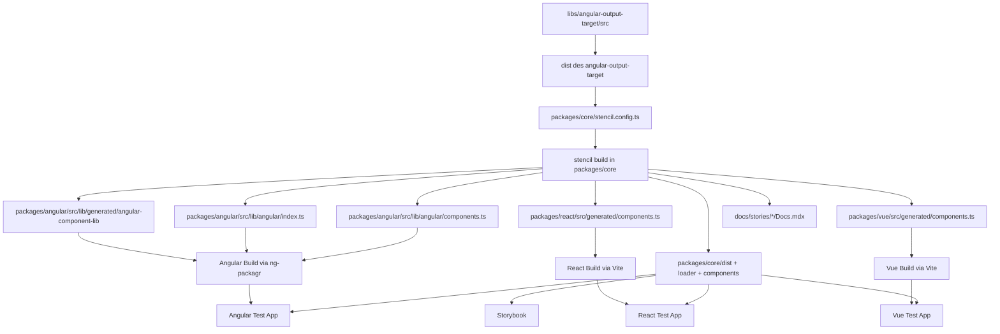
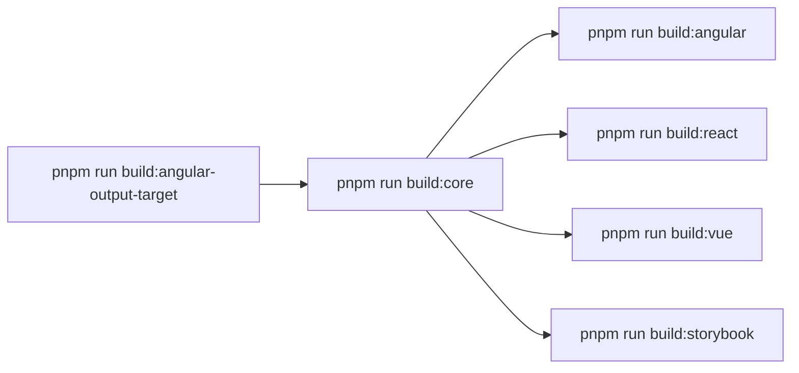

# Projektanalyse: parlamentsdienste-components

## 1. Architektur-Uebersicht

### Monorepo-Setup

Das Repository ist ein pnpm-Workspace-Monorepo mit vier Workspace-Gruppen aus [pnpm-workspace.yaml](../../pnpm-workspace.yaml): `apps/*`, `libs/*`, `packages/*` und `docs`. Die zentrale Orchestrierung liegt in [package.json](../../package.json): Root-Skripte bauen die Pakete in einer festen Reihenfolge, starten lokale Entwicklungsserver und kapseln Pack- sowie Publish-Schritte.

Die eigentliche Fachlogik lebt fast vollstaendig in [packages/core/src/components](../../packages/core/src/components). Die Framework-Pakete sind keine gleichwertigen Implementierungen, sondern Ableitungen aus dem Core-Build:

-   Angular bezieht generierte Proxies in [packages/angular/src/lib/angular/components.ts](../../packages/angular/src/lib/angular/components.ts) und Runtime-Helfer in [packages/angular/src/lib/generated/angular-component-lib](../../packages/angular/src/lib/generated/angular-component-lib).
-   React exportiert nur die generierten Wrapper aus [packages/react/src/generated/components.ts](../../packages/react/src/generated/components.ts).
-   Vue exportiert nur die generierten Wrapper aus [packages/vue/src/generated/components.ts](../../packages/vue/src/generated/components.ts).
-   Storybook konsumiert Core-CSS, Assets und teils generierte MDX-Dateien aus `docs/stories`.

Die fruehere zentrale Graph-Orchestrierung ist entfernt. Heute ergeben sich Abhaengigkeiten aus drei Quellen:

-   Root-Skriptreihenfolgen in [package.json](../../package.json)
-   Workspace-Aufloesung und Source-Aliase in [tsconfig.base.json](../../tsconfig.base.json)
-   Direkte Dateiausgaben des Stencil-Builds in andere Workspace-Pakete, vor allem aus [packages/core/stencil.config.ts](../../packages/core/stencil.config.ts)

### Workspace-Uebersicht

| Workspace                    | Paketname                                  | Rolle                                                                                                 | Relevante Quellen                                                                                                                                                                                                                                                      | Skripte                                                  |
| ---------------------------- | ------------------------------------------ | ----------------------------------------------------------------------------------------------------- | ---------------------------------------------------------------------------------------------------------------------------------------------------------------------------------------------------------------------------------------------------------------------- | -------------------------------------------------------- |
| `libs/angular-output-target` | `@parlamentsdienste/angular-output-target` | Lokaler Custom Output Target fuer Stencil, erzeugt Angular-Proxies und kopiert Angular-Runtime-Helfer | [libs/angular-output-target/src](../../libs/angular-output-target/src), [libs/angular-output-target/angular-component-lib](../../libs/angular-output-target/angular-component-lib), [libs/angular-output-target/resources](../../libs/angular-output-target/resources) | `build`                                                  |
| `packages/core`              | `@parlamentsdienste/pdcomponents-core`     | Source of truth fuer alle Web Components, Styles, Typen, Docs-Generierung                             | [packages/core/src](../../packages/core/src), [packages/core/stencil.config.ts](../../packages/core/stencil.config.ts), [packages/core/utils](../../packages/core/utils)                                                                                               | `build`, `start`, `test`, `test.watch`, `generate`       |
| `packages/angular`           | `@parlamentsdienste/pdcomponents-angular`  | Angular-Wrapper-Paket mit generierten Standalone-Proxies und manuellem `ValueAccessor`                | [packages/angular/src](../../packages/angular/src), [packages/angular/ng-package.json](../../packages/angular/ng-package.json)                                                                                                                                         | `build`                                                  |
| `packages/react`             | `@parlamentsdienste/pdcomponents-react`    | React-Wrapper-Paket; fast vollstaendig generiert, via Vite als Library gebaut                         | [packages/react/src](../../packages/react/src), [packages/react/vite.config.ts](../../packages/react/vite.config.ts)                                                                                                                                                   | `build`                                                  |
| `packages/vue`               | `@parlamentsdienste/pdcomponents-vue`      | Vue-Wrapper-Paket; generiert aus Core-Metadaten, via Vite als Library gebaut                          | [packages/vue/src](../../packages/vue/src), [packages/vue/vite.config.ts](../../packages/vue/vite.config.ts)                                                                                                                                                           | `build`                                                  |
| `docs`                       | `docs`                                     | Storybook-9-Dokumentation fuer die Web Components                                                     | [docs/.storybook](../../docs/.storybook), [docs/stories](../../docs/stories)                                                                                                                                                                                           | `start`, `build`, `test`, `storybook`, `build-storybook` |
| `apps/angular-test`          | `angular-test`                             | Angular-Integrationsapp fuer E2E und Forms-Integration                                                | [apps/angular-test/src](../../apps/angular-test/src), [apps/angular-test/angular.json](../../apps/angular-test/angular.json)                                                                                                                                           | `build`, `serve`, `e2e`                                  |
| `apps/react-test`            | `react-test`                               | React-Integrationsapp fuer E2E der generierten React-Wrapper                                          | [apps/react-test/src](../../apps/react-test/src), [apps/react-test/vite.config.ts](../../apps/react-test/vite.config.ts)                                                                                                                                               | `dev`, `build`, `preview`, `e2e`                         |
| `apps/vue-test`              | `vue-test`                                 | Vue-Integrationsapp fuer E2E der generierten Vue-Wrapper                                              | [apps/vue-test/src](../../apps/vue-test/src), [apps/vue-test/vite.config.ts](../../apps/vue-test/vite.config.ts)                                                                                                                                                       | `dev`, `build`, `preview`, `e2e`                         |

### Build- und Generierungsgraph



Die wesentliche Eigenschaft des Repositories ist: Der Graph ist real, aber nicht formal beschrieben. Er lebt in Ausgabepfaden und Skriptreihenfolgen.

## 2. Build-Pipeline

### 2.1 Core -> Framework-Wrapper Pipeline

#### Schritt 1: `angular-output-target` Build

Das Paket [libs/angular-output-target/package.json](../../libs/angular-output-target/package.json) baut mit `tsc -p tsconfig.lib.json` nach `dist/` und kopiert Markdown-Dateien dazu. Es ist als `commonjs` konfiguriert, exportiert `main` und `types` aus `dist/src/*`, ist aber gleichzeitig `private: true`. Praktisch ist es damit ein lokales Build-Artefakt fuer das Monorepo, kein sauber durch denselben Checkout publizierbarer Produktions-Output.

Die TypeScript-Schicht ist bewusst schlank:

-   [libs/angular-output-target/tsconfig.json](../../libs/angular-output-target/tsconfig.json) erweitert das Root-TSConfig und referenziert nur die Lib-Konfiguration.
-   [libs/angular-output-target/tsconfig.lib.json](../../libs/angular-output-target/tsconfig.lib.json) setzt `outDir: ./dist`, erzeugt Deklarationen und kompiliert `src/**/*.ts`.

Die Generatorbibliothek ist in [libs/angular-output-target/src/lib](../../libs/angular-output-target/src/lib) aufgeteilt:

-   [plugin.ts](../../libs/angular-output-target/src/lib/plugin.ts): Stencil-Einstiegspunkt `angularOutputTarget()`. Die Funktion normalisiert Pfade relativ zu `config.rootDir`, validiert notwendige Optionen und registriert einen `OutputTargetCustom` mit `generator()`-Hook.
-   [output-angular.ts](../../libs/angular-output-target/src/lib/output-angular.ts): Steuert `angularDirectiveProxyOutput()`. Diese Funktion filtert interne Komponenten, liest `package.json` des Core-Pakets, erzeugt Proxy-Text und schreibt parallel Proxies, Barrel-Datei und kopierte Runtime-Ressourcen.
-   [generate-angular-component.ts](../../libs/angular-output-target/src/lib/generate-angular-component.ts): Wandelt Stencil-Metadaten in Angular-Komponentenklassen um. Hier passieren die eigentlichen Uebersetzungen fuer Inputs, Outputs, Methoden, `NG_VALUE_ACCESSOR`-Provider und das `inlineProperties`-Feature. Letzteres erstellt leere Setter-Stubs, damit der Angular Language Service Typen und JSDoc in Templates anzeigen kann.
-   [generate-angular-directives-file.ts](../../libs/angular-output-target/src/lib/generate-angular-directives-file.ts): Erzeugt eine Barrel-Liste `DIRECTIVES` mit allen Proxy-Klassen.
-   [generate-value-accessors.ts](../../libs/angular-output-target/src/lib/generate-value-accessors.ts): Enthaelt die Infrastruktur, um typspezifische Angular-ValueAccessor-Dateien aus Templates zu generieren.
-   [types.ts](../../libs/angular-output-target/src/lib/types.ts): Definiert `OutputTargetAngular`, `OutputType`, `ValueAccessorConfig` und die erlaubten Value-Accessor-Typen.
-   [utils.ts](../../libs/angular-output-target/src/lib/utils.ts): Liefert Normalisierung, Relativpfade, Imports, Typ-Import-Generierung und die `OutputTypes`-Konstanten.

Wichtige Detailbeobachtungen:

-   [output-angular.ts](../../libs/angular-output-target/src/lib/output-angular.ts) kopiert Runtime-Helfer aus [libs/angular-output-target/angular-component-lib/utils.ts](../../libs/angular-output-target/angular-component-lib/utils.ts) nach `packages/angular/src/lib/generated/angular-component-lib`.
-   Die Zeile fuer `generateValueAccessors(...)` ist in [output-angular.ts](../../libs/angular-output-target/src/lib/output-angular.ts) auskommentiert. Die Template-Dateien unter [libs/angular-output-target/resources/control-value-accessors](../../libs/angular-output-target/resources/control-value-accessors) existieren zwar, sind in der aktuellen Pipeline aber nicht aktiv angeschlossen.
-   Das bedeutet: Die zentrale Angular-Forms-Runtime lebt derzeit manuell in [packages/angular/src/lib/angular/value-accessor.ts](../../packages/angular/src/lib/angular/value-accessor.ts), nicht in generierten Accessor-Klassen aus den Templates.

#### Schritt 2: Core-Build mit Stencil

[packages/core/package.json](../../packages/core/package.json) definiert die operative Quelle des Systems. `build` fuehrt `stencil build` aus, `start` startet den Watch-Server, `test` fuehrt Spec- und E2E-Tests der Components aus.

Die logische Vorbedingung fuer `build:core` ist der gebaute Custom Output Target. Der Grund ist direkt in [packages/core/stencil.config.ts](../../packages/core/stencil.config.ts) sichtbar: Das Core-Paket importiert `angularOutputTarget` aus `@parlamentsdienste/angular-output-target` und fuehrt dieses Plugin waehrend des Stencil-Builds aus. Die Root-Skriptreihenfolge in [package.json](../../package.json) erzwingt diese Vorbedingung mit `build:all`, aber `packages/core` selbst enthaelt keinen eigenen Schutz dagegen.

Die Output-Targets in [packages/core/stencil.config.ts](../../packages/core/stencil.config.ts) zerfallen in acht relevante Ausgaben:

| Output Target           | Zweck                                         | Hauptausgabe                                                                 |
| ----------------------- | --------------------------------------------- | ---------------------------------------------------------------------------- |
| `dist`                  | regulare Stencil-Distribution                 | `packages/core/dist`                                                         |
| `dist-custom-elements`  | Custom-Elements-Bundle ohne Lazy Loader       | `packages/core/components`                                                   |
| `docs-readme`           | Readme-Dateien pro Component                  | `packages/core/src/components/*/readme.md`                                   |
| `www`                   | lokales Demobuild                             | `packages/core/www`                                                          |
| `angularOutputTarget()` | Angular-Proxies, Barrel-Datei, Runtime-Helfer | `packages/angular/src/lib/angular/*`, `packages/angular/src/lib/generated/*` |
| `reactOutputTarget()`   | React-Proxies                                 | `packages/react/src/generated/`                                              |
| `docs-custom`           | generierte Storybook-MDX-Dateien              | `docs/stories/<component>/Docs.mdx`                                          |
| `vueOutputTarget()`     | Vue-Proxies mit `v-model`-Modellen            | `packages/vue/src/generated/components.ts`                                   |

Die Angular-Forms-Konfiguration ist in derselben Datei doppelt relevant:

-   `angularValueAccessorConfigs` definiert fuer `pd-input`, `pd-radio-group`, `pd-textarea`, `pd-slider`, `pd-checkbox`, `pd-datepicker`, `pd-dropdown` und `pd-combobox` die Event-/Property-Zuordnung.
-   `vueComponentModels` wird direkt aus `angularValueAccessorConfigs` abgeleitet und erzeugt damit das Vue-`v-model`-Mapping aus derselben Quellliste.

Der Sass-Plugin-Block injiziert globale Stilpfade aus [packages/core/src/styles](../../packages/core/src/styles) sowie Bootstrap-SCSS-Dateien. Komponenten-SCSS muss diese Imports daher nicht lokal wiederholen.

Die Dokumentationsgenerierung laeuft ueber [packages/core/utils/markdown.ts](../../packages/core/utils/markdown.ts). `mdxGenerator()` iteriert ueber Stencil-Docs, filtert einige Komponenten aus und schreibt fuer jede andere Komponente eine `Docs.mdx` in `docs/stories/<tag>/Docs.mdx`.

#### Schritt 3: Angular-Wrapper-Build

[packages/angular/package.json](../../packages/angular/package.json) baut das Angular-Paket mit `ng-packagr` und [packages/angular/ng-package.json](../../packages/angular/ng-package.json). `dest` ist `dist`, `entryFile` ist `src/index.ts`, und `@parlamentsdienste/pdcomponents-core` ist explizit als erlaubte Nicht-Peer-Dependency freigegeben.

Die Angular-TS-Konfigurationen zeigen eine klassische Library-Pipeline:

-   [packages/angular/tsconfig.json](../../packages/angular/tsconfig.json): Basiskonfiguration mit strikten Angular-Template-Pruefungen.
-   [packages/angular/tsconfig.lib.json](../../packages/angular/tsconfig.lib.json): Deklarationen, Declaration Maps und ein Path-Mapping fuer `@parlamentsdienste/pdcomponents-core/components/*`.
-   [packages/angular/tsconfig.lib.prod.json](../../packages/angular/tsconfig.lib.prod.json): `compilationMode: partial` fuer paketfaehige Angular-Artefakte.

Die Artefaktgrenzen sind scharf:

| Status    | Datei/Pfad                                                                                                                 | Rolle                                                                                 |
| --------- | -------------------------------------------------------------------------------------------------------------------------- | ------------------------------------------------------------------------------------- |
| generiert | [packages/angular/src/lib/angular/components.ts](../../packages/angular/src/lib/angular/components.ts)                     | alle Standalone-Proxies, inklusive `ValueAccessor`-Vererbung und Output-Event-Mapping |
| generiert | [packages/angular/src/lib/angular/index.ts](../../packages/angular/src/lib/angular/index.ts)                               | `DIRECTIVES`-Barrel                                                                   |
| generiert | [packages/angular/src/lib/generated/angular-component-lib](../../packages/angular/src/lib/generated/angular-component-lib) | Runtime-Helfer wie `ProxyCmp`, `proxyOutputs`, `proxyInputs`, `proxyMethods`          |
| manuell   | [packages/angular/src/lib/angular/value-accessor.ts](../../packages/angular/src/lib/angular/value-accessor.ts)             | Basis-`ControlValueAccessor` mit `INPUTMAP`                                           |
| manuell   | [packages/angular/src/index.ts](../../packages/angular/src/index.ts)                                                       | Paketexport der generierten Proxies                                                   |

Der entscheidende Punkt fuer die Analyse: Angular wird nicht nur aus eigenen Quellen gebaut, sondern aus einer Mischung aus manuell gepflegtem Runtime-Code und waehrend des Core-Builds in dieses Paket hineingeschriebenen Dateien.

#### Schritt 4: React- und Vue-Wrapper-Builds

React und Vue sind leichtergewichtig als Angular.

React:

-   [packages/react/package.json](../../packages/react/package.json) baut per `vite build`.
-   [packages/react/vite.config.ts](../../packages/react/vite.config.ts) baut `src/index.ts` als ES-Library, erzeugt `.d.ts` via `vite-plugin-dts` und externalisiert `react`, `react-dom`, `react/jsx-runtime` sowie `@parlamentsdienste/pdcomponents-core`.
-   [packages/react/src/index.ts](../../packages/react/src/index.ts) re-exportiert nur [packages/react/src/generated/components.ts](../../packages/react/src/generated/components.ts).

Vue:

-   [packages/vue/package.json](../../packages/vue/package.json) baut ebenfalls per `vite build`.
-   [packages/vue/vite.config.ts](../../packages/vue/vite.config.ts) externalisiert `@parlamentsdienste/pdcomponents-core` und `@stencil/vue-output-target/runtime`.
-   [packages/vue/src/index.ts](../../packages/vue/src/index.ts) re-exportiert nur [packages/vue/src/generated/components.ts](../../packages/vue/src/generated/components.ts).

Die generierten Dateien zeigen die unterschiedliche Adaptertiefe:

-   [packages/react/src/generated/components.ts](../../packages/react/src/generated/components.ts) bindet jedes Custom Element ueber `createComponent()` an React und mappt Events zu React-Props.
-   [packages/vue/src/generated/components.ts](../../packages/vue/src/generated/components.ts) erzeugt `defineContainer()`-Wrapper und nutzt fuer die acht Form-Controls explizite `modelValue`-Aequivalente aus `componentModels`.

### 2.2 Vollstaendige Build-Kette

Die reale Reihenfolge ist in [package.json](../../package.json) fest kodiert:

```text
build:angular-output-target
  -> build:core
      -> build:angular
      -> build:react
      -> build:vue
      -> build:storybook
```



`build:all` erzwingt diese Reihenfolge mit shell-sequenziellen `&&`. Es gibt keine zusaetzliche formale Plausibilisierung. Wenn jemand Root-Skripte umsortiert oder einzelne Paket-Builds direkt startet, entstehen sofort versteckte Vorbedingungen.

Teilprojekte, die einzeln baubar sind, aber implizite Voraussetzungen haben:

-   `build:core`: benoetigt einen aufloesbaren `@parlamentsdienste/angular-output-target`-Build.
-   `build:angular`: benoetigt bereits erzeugte Dateien in `packages/angular/src/lib/angular/*` und `src/lib/generated/*`.
-   `build:react`: benoetigt [packages/react/src/generated/components.ts](../../packages/react/src/generated/components.ts) aus dem Core-Build.
-   `build:vue`: benoetigt [packages/vue/src/generated/components.ts](../../packages/vue/src/generated/components.ts) aus dem Core-Build.
-   `build:storybook`: benoetigt Core-CSS, Core-Assets und im Regelfall auch die generierten MDX-Dateien aus dem Core-Build.

Konkrete Risiken durch die Entfernung zentraler Monorepo-Orchestrierung:

-   Build-Voraussetzungen sind nicht deklarativ absicherbar, sondern nur implizit ueber Skriptordnung.
-   CI-Jobs koennen leicht Teilketten vergessen. [stencil-tests.yml](../../.github/workflows/stencil-tests.yml) baut zum Beispiel nur `build:core`, nicht explizit den Custom Output Target.
-   Docker baut in [Dockerfile](../../Dockerfile) direkt `build:storybook`, obwohl Storybook auf Core-Dist-Artefakte verweist.
-   Keine zentrale Caching- oder Inkrementalitaetslogik erkennt automatisch, ob nur Wrapper, nur Docs oder nur Styles neu gebaut werden muessten.

## 3. Komponenten-Architektur

### 3.1 StencilJS Core Components

Unter [packages/core/src/components](../../packages/core/src/components) liegen 42 Komponentenverzeichnisse von `pd-alert` bis `pd-toast`. Die Struktur ist konsistent: je Komponente typischerweise TSX, SCSS, Tests und eine generierte Readme.

Eine gute Referenz ist `pd-input`:

-   [packages/core/src/components/pd-input/pd-input.tsx](../../packages/core/src/components/pd-input/pd-input.tsx): `@Component`, viele `@Prop`s, mehrere `@Event`s, `@Method setFocus()`, `@Watch('value')` und Render-Funktion.
-   [packages/core/src/components/pd-input/pd-input.scss](../../packages/core/src/components/pd-input/pd-input.scss): komponentenspezifisches Styling auf Basis global injizierter Sass-Helfer.
-   [packages/core/src/components/pd-input/test/pd-input.spec.ts](../../packages/core/src/components/pd-input/test/pd-input.spec.ts): Unit-/Spec-Tests.
-   [packages/core/src/components/pd-input/test/pd-input.e2e.ts](../../packages/core/src/components/pd-input/test/pd-input.e2e.ts): Browser-E2E fuer das Custom Element.
-   [packages/core/src/components/pd-input/readme.md](../../packages/core/src/components/pd-input/readme.md): durch `docs-readme` erzeugte Komponenten-Doku.

Daneben enthaelt [packages/core/src](../../packages/core/src) gemeinsame Infrastruktur:

-   [packages/core/src/index.ts](../../packages/core/src/index.ts): zentraler Exporteinstieg.
-   [packages/core/src/types](../../packages/core/src/types): gemeinsame Event- und Datenstrukturen.
-   [packages/core/src/utils](../../packages/core/src/utils): Hilfsfunktionen fuer Komponenten und Consumer.
-   [packages/core/src/styles/pd-bootstrap.scss](../../packages/core/src/styles/pd-bootstrap.scss): globaler Style-Einstieg.

Die Stilbasis in [packages/core/src/styles](../../packages/core/src/styles) gliedert sich in:

-   [variables.scss](../../packages/core/src/styles/variables.scss)
-   [functions.scss](../../packages/core/src/styles/functions.scss)
-   [mixins.scss](../../packages/core/src/styles/mixins.scss)
-   [pd-bootstrap.scss](../../packages/core/src/styles/pd-bootstrap.scss)
-   [typography.css](../../packages/core/src/styles/typography.css)

### 3.2 Form Controls und Value Accessors

Die Form-Bindings sind bewusst dual konfiguriert:

1. [packages/core/stencil.config.ts](../../packages/core/stencil.config.ts) definiert `angularValueAccessorConfigs` und leitet daraus `vueComponentModels` ab.
2. [packages/angular/src/lib/angular/value-accessor.ts](../../packages/angular/src/lib/angular/value-accessor.ts) enthaelt `INPUTMAP` fuer das Runtime-Schreiben von Werten in native Elemente.

Der aktuelle Stand ist fachlich synchron:

| Component        | Event        | Target-Attribut | In `INPUTMAP` vorhanden |
| ---------------- | ------------ | --------------- | ----------------------- |
| `pd-input`       | `pd-change`  | `value`         | ja                      |
| `pd-radio-group` | `pd-change`  | `value`         | ja                      |
| `pd-textarea`    | `pd-change`  | `value`         | ja                      |
| `pd-slider`      | `pd-change`  | `value`         | ja                      |
| `pd-checkbox`    | `pd-checked` | `checked`       | ja                      |
| `pd-datepicker`  | `pd-change`  | `date`          | ja                      |
| `pd-dropdown`    | `pd-change`  | `selected`      | ja                      |
| `pd-combobox`    | `pd-change`  | `selected`      | ja                      |

Trotzdem gibt es keinen technischen Schutz gegen Drift. Die wichtigsten Gruende:

-   `INPUTMAP` ist manuell.
-   Die Generatorfunktion fuer separate Angular-Accessor-Dateien ist derzeit deaktiviert.
-   Die Konfiguration fuer Vue wird automatisch aus `angularValueAccessorConfigs` abgeleitet, die Angular-Runtime aber nicht.

Fachlich bedeutet das: Vue bekommt neue Form-Control-Mappings bei Aenderungen automatisch mit, Angular nur teilweise. Fuer Angular muessen mindestens `angularValueAccessorConfigs` und `INPUTMAP` parallel gepflegt werden.

## 4. Dokumentation und Storybook

Das `docs`-Paket ist eine eigenstaendige Storybook-9-App auf Basis von `@storybook/html-vite`, konfiguriert in [docs/package.json](../../docs/package.json), [docs/.storybook/main.ts](../../docs/.storybook/main.ts) und [docs/.storybook/preview.ts](../../docs/.storybook/preview.ts).

Die Abhaengigkeit zum Core ist direkt und dateibasiert:

-   `preview.ts` importiert `@parlamentsdienste/pdcomponents-core/styles/parlamentsdienstecore.css` und `typography.css`.
-   `main.ts` bindet Assets aus `../node_modules/@parlamentsdienste/pdcomponents-core/dist/parlamentsdienstecore/assets` als `staticDirs` ein.
-   `main.ts` definiert zusaetzlich einen Vite-Alias fuer `@parlamentsdienste/pdcomponents-core/utils`, weil im Workspace-Symlink der Exportpfad auf Dist-Dateien zeigen wuerde, die im Dev-Setup nicht immer existieren.

Die Story-Struktur ist komponentenbasiert organisiert:

-   pro Komponente typischerweise `pd-<name>.stories.ts`, z. B. [docs/stories/pd-input/pd-input.stories.ts](../../docs/stories/pd-input/pd-input.stories.ts)
-   pro Komponente eine `Docs.mdx`, die teils manuell, teils aus dem Core-Build geschrieben wird
-   Hilfslogik fuer Event-Logging in [docs/stories/utils/eventListeners.ts](../../docs/stories/utils/eventListeners.ts)

Die Stories selbst verwenden HTML-String-Templates statt JSX. `addEventlisteners()` haengt DOM-Listener erst nach `DOMContentLoaded` an und leitet gefilterte Eventdaten an Storybook Actions weiter.

## 5. E2E-Test-Apps

Alle drei Test-Apps pruefen Wrapper in echten Framework-Laufzeiten, aber ihr Startmodus zeigt auch die Build-Voraussetzungen sehr deutlich.

### Angular-Test-App

-   Paket: [apps/angular-test/package.json](../../apps/angular-test/package.json)
-   Build-/Serve-Konfiguration: [apps/angular-test/angular.json](../../apps/angular-test/angular.json)
-   Playwright: [apps/angular-test/playwright.config.ts](../../apps/angular-test/playwright.config.ts)
-   Einstieg: [apps/angular-test/src/main.ts](../../apps/angular-test/src/main.ts)
-   Formular-Komponente: [apps/angular-test/src/app/angular-form.component.ts](../../apps/angular-test/src/app/angular-form.component.ts)
-   Asset-Pfad: [apps/angular-test/src/app/app.config.ts](../../apps/angular-test/src/app/app.config.ts)

Die App importiert Wrapper direkt aus `@parlamentsdienste/pdcomponents-angular` und bindet Core-CSS und Core-Assets ueber `angular.json` aus `node_modules/@parlamentsdienste/pdcomponents-core/dist/...` ein. Damit sind sowohl Angular-Proxies als auch Core-Dist-Artefakte Voraussetzung fuer sinnvolle E2E-Laeufe.

### React-Test-App

-   Paket: [apps/react-test/package.json](../../apps/react-test/package.json)
-   Vite: [apps/react-test/vite.config.ts](../../apps/react-test/vite.config.ts)
-   Playwright: [apps/react-test/playwright.config.ts](../../apps/react-test/playwright.config.ts)
-   Einstieg: [apps/react-test/src/main.tsx](../../apps/react-test/src/main.tsx)
-   Form-App: [apps/react-test/src/app/app.tsx](../../apps/react-test/src/app/app.tsx)

Die React-App importiert Wrapper aus `@parlamentsdienste/pdcomponents-react`, setzt `setAssetPath('http://localhost:4200')` und kopiert ueber `viteStaticCopy` die Core-Assets aus `node_modules/@parlamentsdienste/pdcomponents-core/dist/parlamentsdienstecore/assets` in den Dev-/Build-Output. Ohne Core-Build fehlt diese Asset-Quelle.

### Vue-Test-App

-   Paket: [apps/vue-test/package.json](../../apps/vue-test/package.json)
-   Vite: [apps/vue-test/vite.config.ts](../../apps/vue-test/vite.config.ts)
-   Playwright: [apps/vue-test/playwright.config.ts](../../apps/vue-test/playwright.config.ts)
-   Einstieg: [apps/vue-test/src/main.ts](../../apps/vue-test/src/main.ts)
-   Beispiel-App: [apps/vue-test/src/app/App.vue](../../apps/vue-test/src/app/App.vue)

Die Vue-App ist analog verdrahtet: Wrapper via `@parlamentsdienste/pdcomponents-vue`, Core-CSS direkt importiert, Assets ueber `viteStaticCopy`. Auffaellig ist, dass `v-model` fuer die meisten Controls sauber aus dem generierten Modell greift, waehrend `pd-datepicker` wegen seines Event-Payloads noch mit einem zusaetzlichen `@pd-change` nachjustiert wird.

## 6. Deployment und CI/CD

### Deployment

Das Deployment-Verzeichnis [deployment](../../deployment) enthaelt Kubernetes-Manifeste fuer Namespace, Registry-Secret und Storybook-Betrieb. Der Container-Build wird in [Dockerfile](../../Dockerfile) definiert:

-   Stage 1 installiert pnpm-Abhaengigkeiten und fuehrt `npm run build:storybook` aus.
-   Stage 2 kopiert `docs/storybook-static` in ein Nginx-Image und nutzt die Nginx-Templates aus [docs/nginx-config](../../docs/nginx-config).

Wichtig ist die Implikation: Der Docker-Build baut Storybook direkt, aber nicht explizit den Core. Das funktioniert nur, wenn die benoetigten Core-Dist-Dateien bereits durch Workspace-Zustand oder vorherige Artefakte vorhanden sind.

### GitHub Actions

| Workflow        | Datei                                                              | Verhalten                                                   | Beobachtung                                                         |
| --------------- | ------------------------------------------------------------------ | ----------------------------------------------------------- | ------------------------------------------------------------------- |
| Stencil Tests   | [stencil-tests.yml](../../.github/workflows/stencil-tests.yml)     | `pnpm install`, `pnpm run build:core`, `pnpm run test:core` | baut den Custom Output Target nicht explizit vor                    |
| Wrapper E2E     | [wrapper-e2e.yml](../../.github/workflows/wrapper-e2e.yml)         | `pnpm run build:all`, danach Angular-, React- und Vue-E2E   | folgt der korrekten Gesamtkette                                     |
| Storybook Build | [storybook-build.yml](../../.github/workflows/storybook-build.yml) | Docker-Build und Push                                       | verlässt sich auf Dockerfile-Logik ohne separate Vorstufe fuer Core |

Durch die Entfernung der frueheren zentralen Monorepo-Schicht werden CI-Eigenschaften heute lokal pro Job entschieden:

-   keine gemeinsame Graphsicht auf notwendige Vorstufen
-   kein automatisches selektives Task-Caching pro Paketbeziehung
-   Parallelisierung muss manuell ueber Jobs oder Shell-Reihenfolgen modelliert werden

## 7. Package Publishing

Der Publishing-Flow ist ausschliesslich in [package.json](../../package.json) beschrieben.

### Pack-Skripte

-   `pack:core` wechselt nach `packages/core` und fuehrt `npm pack` dort aus.
-   `pack:angular` packt aus `packages/angular/dist`.
-   `pack:react` packt aus `packages/react/dist`.
-   `pack:vue` packt aus `packages/vue/dist`.

### Publish-Skripte

-   `publish:core` publiziert direkt aus `packages/core`.
-   `publish:angular` publiziert aus `packages/angular/dist`.
-   `publish:react` publiziert aus `packages/react/dist`.
-   `publish:vue` publiziert aus `packages/vue/dist`.

### Paket-Mapping

| Paket                                     | Publish-Quelle          | Vorbedingung                                                                       |
| ----------------------------------------- | ----------------------- | ---------------------------------------------------------------------------------- |
| `@parlamentsdienste/pdcomponents-core`    | `packages/core`         | erfolgreicher `stencil build`                                                      |
| `@parlamentsdienste/pdcomponents-angular` | `packages/angular/dist` | Core-Build hat Angular-Proxies und Runtime-Helfer geschrieben, danach `ng-packagr` |
| `@parlamentsdienste/pdcomponents-react`   | `packages/react/dist`   | Core-Build hat React-Proxies geschrieben, danach `vite build`                      |
| `@parlamentsdienste/pdcomponents-vue`     | `packages/vue/dist`     | Core-Build hat Vue-Proxies geschrieben, danach `vite build`                        |

Versionierung laeuft ueber [tools/update-versions.ts](../../tools/update-versions.ts). Das Skript aktualisiert Versionen in Root, `libs/angular-output-target`, `packages/core`, `packages/angular`, `packages/react`, `packages/vue` und `docs`, plus alle `@parlamentsdienste/*`-Abhaengigkeiten in `dependencies` und `devDependencies`.

## 8. Konfiguration und Tooling

### pnpm

[pnpm-workspace.yaml](../../pnpm-workspace.yaml) aktiviert `linkWorkspacePackages: true`. Das ist fuer lokale Entwicklung zentral, weil Paketimporte direkt auf Workspace-Pakete aufgeloest werden. Gleichzeitig macht genau das Dist-Voraussetzungen sichtbarer: wenn ein Paketexport auf `dist/*` zeigt, muessen diese Dateien lokal vorhanden sein.

### TypeScript

[tsconfig.base.json](../../tsconfig.base.json) ist der wichtigste glue layer ausserhalb der Build-Skripte. Es mappt unter anderem:

-   `@parlamentsdienste/angular-output-target` -> `libs/angular-output-target/src/index.ts`
-   `@parlamentsdienste/pdcomponents-core` -> `packages/core/src/index.ts`
-   `@parlamentsdienste/pdcomponents-angular` -> `packages/angular/src/index.ts`
-   `@parlamentsdienste/pdcomponents-react` -> `packages/react/src/index.ts`
-   `@parlamentsdienste/pdcomponents-vue` -> `packages/vue/src/index.ts`

Fuer TypeScript-Werkzeuge existiert damit eine quellnahe Sicht auf Workspace-Pakete. Runtime- und Bundler-Verhalten koennen dennoch auf Package-Exports zeigen, wodurch die oben beschriebenen impliziten Dist-Voraussetzungen entstehen.

### ESLint

[eslint.config.mjs](../../eslint.config.mjs) ist eine kleine Flat-Config auf Basis von `typescript-eslint`, die im Wesentlichen Empfehlungen uebernimmt und Dist-/Timestamp-Artefakte ignoriert. Repository-weite Lint-Orchestrierung ist damit bewusst einfach gehalten.

### Tool-Rollen im Monorepo

| Tool                | Rolle                                                        |
| ------------------- | ------------------------------------------------------------ |
| Stencil             | baut Core, generiert Wrapper-Quellen und Komponenten-Doku    |
| ng-packagr          | paketiert den Angular-Wrapper                                |
| Vite                | baut React- und Vue-Wrapper sowie zwei Test-Apps             |
| Angular CLI         | baut und servt die Angular-Test-App                          |
| Storybook HTML Vite | erzeugt und servt die Dokumentation                          |
| Playwright          | prueft Wrapper in realen Framework-Apps                      |
| pnpm Workspaces     | loest lokale Paketbeziehungen und Root-Skript-Orchestrierung |

Diese Tool-Konfigurationen ersetzen heute die fruehere zentrale Monorepo-Koordination durch eine Kombination aus lokalen Regeln, Source-Aliases und Shell-Reihenfolgen.

## Generierte vs. manuell gepflegte Dateien

| Datei/Pfad                                                                                                                                   | Status            | Herkunft                                                                 |
| -------------------------------------------------------------------------------------------------------------------------------------------- | ----------------- | ------------------------------------------------------------------------ |
| [packages/angular/src/lib/angular/components.ts](../../packages/angular/src/lib/angular/components.ts)                                       | generiert         | `angularOutputTarget()` waehrend `build:core`                            |
| [packages/angular/src/lib/angular/index.ts](../../packages/angular/src/lib/angular/index.ts)                                                 | generiert         | `generateAngularDirectivesFile()`                                        |
| [packages/angular/src/lib/generated/angular-component-lib/utils.ts](../../packages/angular/src/lib/generated/angular-component-lib/utils.ts) | generiert/kopiert | `copyResources()` aus `libs/angular-output-target/angular-component-lib` |
| [packages/react/src/generated/components.ts](../../packages/react/src/generated/components.ts)                                               | generiert         | `reactOutputTarget()`                                                    |
| [packages/vue/src/generated/components.ts](../../packages/vue/src/generated/components.ts)                                                   | generiert         | `vueOutputTarget()`                                                      |
| [docs/stories/\*/Docs.mdx](../../docs/stories)                                                                                               | teils generiert   | `docs-custom` via `mdxGenerator()`                                       |
| [packages/angular/src/lib/angular/value-accessor.ts](../../packages/angular/src/lib/angular/value-accessor.ts)                               | manuell           | Angular-Forms-Runtime                                                    |
| [packages/core/src/components/\*](../../packages/core/src/components)                                                                        | manuell           | eigentliche Komponentenimplementierung                                   |

## Risiken und Inkonsistenzen

1. `build:core` hat eine versteckte Vorbedingung auf einen funktionsfaehigen `@parlamentsdienste/angular-output-target`-Build, die nicht lokal am Paket abgesichert ist.
2. Storybook und die drei Test-Apps beziehen Core-CSS und Assets ueber `dist`-Pfade; reine Source-Links reichen also nicht.
3. `INPUTMAP` und `angularValueAccessorConfigs` sind synchron, aber nur organisatorisch, nicht technisch.
4. Die Value-Accessor-Template-Generierung ist vorhanden, aber deaktiviert; das erhoeht das Risiko, dass Entwickler von einer aktiven Generierung ausgehen, die real nicht stattfindet.
5. `libs/angular-output-target` traegt Versions- und Entry-Point-Metadaten wie ein publizierbares Paket, ist aber zugleich `private: true`; der Status als reines internes Build-Artefakt sollte bewusst so verstanden werden.
6. [Dockerfile](../../Dockerfile) und [storybook-build.yml](../../.github/workflows/storybook-build.yml) erzwingen den Core-Build nicht explizit vor Storybook.

## Kurzfazit

Dieses Monorepo funktioniert ohne Nx, weil der Core-Build nicht nur Artefakte fuer `packages/core` erzeugt, sondern den Rest des Systems aktiv materialisiert: Angular-Proxies, React-Proxies, Vue-Proxies und Storybook-MDX. Die eigentliche Kopplung liegt deshalb nicht primaer in `package.json`-Dependencies, sondern in Build-seitigen Dateiausgaben und in Root-Skripten, die diese Reihenfolge einhalten muessen.

Das staerkste Architekturmotiv ist klar und konsistent: `packages/core` ist die einzige produktive Komponentenquelle. Die groessten Risiken liegen nicht in der Komponentenlogik, sondern in impliziten Vorstufen, die heute nur durch Konvention und Skriptordnung abgesichert sind.
