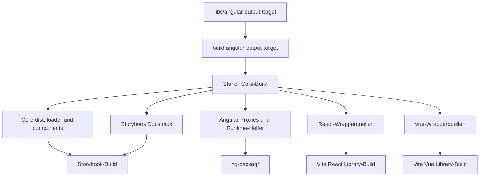

# Projektanalyse: parlamentsdienste-components

Stand: August 2026

## 1. Architektur

Das Repository ist ein pnpm-Workspace-Monorepo. Die Workspace-Gruppen sind in [pnpm-workspace.yaml](../pnpm-workspace.yaml) definiert:

- `apps/*`: Integrations- und E2E-Testanwendungen
- `libs/*`: interner Angular Output Target
- `packages/*`: publizierbare Core-, Angular-, React- und Vue-Pakete
- `docs`: Storybook-Dokumentation

Die Komponentenimplementierungen liegen ausschließlich unter [packages/core/src/components](../packages/core/src/components). Der Core-Build erzeugt daraus zusätzlich Quellen für die Framework-Wrapper und die Dokumentation. React- und Vue-Wrapper sowie die Angular-Proxies dürfen deshalb nicht manuell geändert werden.

| Workspace                    | Rolle                                             | Build-Werkzeug                  |
| ---------------------------- | ------------------------------------------------- | ------------------------------- |
| `libs/angular-output-target` | lokaler, angepasster Stencil Output Target        | TypeScript (`tsc`)              |
| `packages/core`              | Web Components, Styles, Typen und Generatorquelle | Stencil 4                       |
| `packages/angular`           | Angular-Wrapper                                   | ng-packagr / Angular 22         |
| `packages/react`             | React-Wrapper                                     | Vite 7 / React 19               |
| `packages/vue`               | Vue-Wrapper                                       | Vite 7 / Vue 3                  |
| `docs`                       | Komponenten-Dokumentation                         | Storybook 10 mit HTML/Vite      |
| `apps/*-test`                | Framework-Integration und Playwright-E2E          | Angular CLI oder Vite           |
| `tools/compat`               | Tests gegen frisch erzeugte Consumer-Projekte     | Docker, npm/pnpm und Playwright |

Die zentralen Werkzeugversionen werden über Kataloge in [pnpm-workspace.yaml](../pnpm-workspace.yaml) verwaltet. Der Katalogname `storybook9` ist historisch; die darin hinterlegte und verwendete Version ist Storybook 10.5.0.

## 2. Build- und Generierungsgraph

Die Root-Skripte in [package.json](../package.json) bilden die Reihenfolge explizit ab:

```text
build:angular-output-target
  -> build:core
      -> build:angular
      -> build:react
      -> build:vue
      -> build:storybook
```

`pnpm run build:all` führt diese Schritte sequenziell aus. Es gibt keinen Nx-, Turbo- oder vergleichbaren deklarativen Task-Graphen.



### Angular Output Target

[libs/angular-output-target](../libs/angular-output-target) ist ein privater lokaler Fork von `@stencil/angular-output-target`. Er wird vor Core kompiliert und über eine Workspace-Abhängigkeit eingebunden.

Die wesentlichen Anpassungen sind:

- `inlineProperties` erzeugt Angular-Setter-Stubs für Stencil-Properties, damit der Angular Language Service Typen und JSDoc in Templates erkennt.
- Bei `esModules: true` entstehen einzelne `pd-*.ts`-Proxies und Barrel-Dateien.
- Runtime-Helfer aus `angular-component-lib` werden nach `packages/angular/src/lib/generated` kopiert.
- Die Infrastruktur für separate generierte Value-Accessor-Dateien existiert, ist in `output-angular.ts` aber deaktiviert.

### Core-Build

[packages/core/stencil.config.ts](../packages/core/stencil.config.ts) konfiguriert folgende Ausgaben:

| Ausgabe                | Ziel                                                        |
| ---------------------- | ----------------------------------------------------------- |
| `dist`                 | `packages/core/dist`                                        |
| `dist-custom-elements` | `packages/core/components`                                  |
| `docs-readme`          | Komponenten-Readmes; derzeit redundant zweimal konfiguriert |
| `www`                  | lokaler Demo-Build                                          |
| Angular Output Target  | `packages/angular/src/lib/angular` und `src/lib/generated`  |
| React Output Target    | `packages/react/src/generated`                              |
| Vue Output Target      | `packages/vue/src/generated`                                |
| `docs-custom`          | `docs/stories/<component>/Docs.mdx`                         |

Nach `stencil build` passt [packages/core/scripts/patch-components-index.mjs](../packages/core/scripts/patch-components-index.mjs) den Custom-Elements-Einstieg an. Dadurch erzeugt Angular/esbuild keine `empty-glob`-Warnung für nicht vorhandene Lazy-Loader-Entry-Dateien.

### Framework-Builds

Angular baut die generierten Proxies und den manuell gepflegten Forms-Adapter mit ng-packagr. Der Produktionsbuild verwendet partielle Angular-Kompilierung.

React und Vue bauen `src/index.ts` als reine ESM-Library mit Vite und erzeugen Deklarationen über `vite-plugin-dts`. Beide Builds externalisieren Core und die jeweilige Framework-Runtime, statt diese Abhängigkeiten einzubetten.

## 3. Generierte und manuelle Quellen

| Pfad                                                 | Status              | Quelle                     |
| ---------------------------------------------------- | ------------------- | -------------------------- |
| `packages/core/src/components/*`                     | manuell             | Komponentenimplementierung |
| `packages/angular/src/lib/angular/components.ts`     | generiert           | Core-Build                 |
| `packages/angular/src/lib/angular/pd-*.ts`           | generiert           | Core-Build                 |
| `packages/angular/src/lib/angular/index.ts`          | generiert           | Core-Build                 |
| `packages/angular/src/lib/generated/*`               | generiert/kopiert   | Angular Output Target      |
| `packages/angular/src/lib/angular/value-accessor.ts` | manuell             | Angular Forms Runtime      |
| `packages/react/src/generated/components.ts`         | generiert           | Core-Build                 |
| `packages/vue/src/generated/components.ts`           | generiert           | Core-Build                 |
| `docs/stories/*/Docs.mdx`                            | teilweise generiert | Core-Build                 |

Der Core-Build schreibt damit bewusst in andere Workspaces. Einzelne Wrapper-Builds setzen voraus, dass diese Dateien bereits erzeugt wurden.

## 4. Form Controls

Form-Control-Mappings werden an zwei Stellen gepflegt:

1. `angularValueAccessorConfigs` in [packages/core/stencil.config.ts](../packages/core/stencil.config.ts)
2. `INPUTMAP` in [packages/angular/src/lib/angular/value-accessor.ts](../packages/angular/src/lib/angular/value-accessor.ts)

Aus `angularValueAccessorConfigs` werden zusätzlich die Vue-Modelle abgeleitet. Aktuell sind `pd-input`, `pd-radio-group`, `pd-textarea`, `pd-slider`, `pd-checkbox`, `pd-datepicker`, `pd-dropdown` und `pd-combobox` erfasst.

Neue Form Controls müssen in beiden manuellen Konfigurationen ergänzt werden. Es gibt weiterhin keinen automatischen Drift-Test zwischen ihnen.

## 5. TypeScript-Konfiguration

Die Konfiguration ist geschichtet:

- [tsconfig.base.json](../tsconfig.base.json) enthält gemeinsame strikte Sicherheitsoptionen, aber keine zentralen `paths`.
- [tsconfig.web.json](../tsconfig.web.json) ergänzt ESM-, Bundler-, ES2022- und Browser-Defaults.
- Core und Docs erweitern `tsconfig.web.json`, deaktivieren lokal aber `strict`.
- React, Vue und ihre Test-Apps verwenden die Web-Basis mit paketbezogenen Einstellungen.
- Angular definiert ESM-, Bundler- und Angular-Compiler-Optionen lokal auf Basis von `tsconfig.base.json`.
- Nur [packages/angular/tsconfig.lib.json](../packages/angular/tsconfig.lib.json) besitzt ein lokales Mapping für `@parlamentsdienste/pdcomponents-core/components/*`.
- Der Angular-Produktionsbuild aktiviert `compilationMode: partial`.
- Der interne Angular Output Target kompiliert als CommonJS und erweitert ebenfalls die Root-Basis.

pnpm verknüpft lokale Pakete durch `linkWorkspacePackages: true`. Die Auflösung zur Laufzeit folgt trotzdem den jeweiligen Package-Exports; notwendige Dist-Dateien müssen daher vorhanden sein.

## 6. Package-Exports

Das Core-Paket exportiert:

- Root-API aus `dist`
- Lazy Loader über `./loader`
- Custom Elements über `./components` und `./components/*.js`
- CSS über `./styles/*.css`
- Hilfsfunktionen über `./utils`

React und Vue exportieren jeweils einen ESM-Einstieg aus `dist/index.js` und Deklarationen aus `dist/src/index.d.ts`. Angular wird als ng-packagr-Ausgabe paketiert. Alle Wrapper haben Core als reguläre Abhängigkeit; die Framework-Runtimes sind Peer Dependencies beziehungsweise werden beim Build externalisiert.

Aktuelle Peer-Spannen:

| Wrapper | Unterstützte Peer-Versionen                       |
| ------- | ------------------------------------------------- |
| Angular | Angular Core/Forms `>=19 <23`, RxJS 6.5 oder 7.4+ |
| React   | React und React DOM 18 oder 19                    |
| Vue     | Vue `>=3.4.38 <4`                                 |

## 7. Storybook

[docs](../docs) ist eine Storybook-10-App auf Basis von `@storybook/html-vite`. Sie importiert Core-CSS, bindet Core-Assets ein und verwendet die vom Core-Build erzeugten `Docs.mdx`-Dateien.

Wichtige Befehle:

```bash
pnpm run start:storybook
pnpm run build:storybook
```

Das `test`-Script des Docs-Pakets ist nur ein Platzhalter und endet absichtlich mit Fehler. Für Storybook existiert derzeit kein eigener automatisierter Testlauf.

## 8. Integrations- und Kompatibilitätstests

### Workspace-Testanwendungen

Die Anwendungen unter `apps` testen die Wrapper direkt im Monorepo:

- Angular verwendet Angular CLI und Playwright.
- React und Vue verwenden Vite und Playwright.
- Alle drei benötigen zuvor erzeugte Wrapper sowie Core-CSS und Core-Assets.

Der Workflow [.github/workflows/wrapper-e2e.yml](../.github/workflows/wrapper-e2e.yml) führt einmal `build:all` aus und testet danach Angular, React und Vue im selben Job.

### Consumer-Kompatibilität

[tools/compat](../tools/compat/README.md) bildet eine zweite Testebene. Die Docker-basierten Skripte erzeugen neue Consumer-Projekte, installieren die zuvor gepackten Core- und Wrapper-Tarballs und führen einen Build sowie optional Playwright-E2E aus.

Abgedeckt sind:

- Angular-Fixtures für Angular 17 bis 22
- dynamisch erzeugte React-Consumer
- dynamisch erzeugte Vue-Consumer
- konfigurierbare Node-Version, standardmäßig 24.18.0
- für React und Vue eine standardmäßig auf 9.2.0 gepinnte `create-vite`-Version

Beispiele:

```bash
./tools/compat/angular/run.sh 20 --node-version=22 --e2e
./tools/compat/react/run.sh 19 --node-version=22 --e2e
./tools/compat/vue/run.sh 3 --node-version=22 --e2e
```

Die Compat-Skripte werden manuell ausgeführt. Keiner der aktuellen GitHub-Actions-Workflows startet sie. Angular 17 und 18 dienen als historische Kompatibilitätsproben; die veröffentlichte Angular-Peer-Spanne beginnt aktuell bei Version 19.

## 9. CI und Deployment

| Workflow              | Verhalten                                                           |
| --------------------- | ------------------------------------------------------------------- |
| `stencil-tests.yml`   | baut Angular Output Target und Core, danach Core-Tests              |
| `wrapper-e2e.yml`     | führt `build:all` aus, installiert Chromium und testet alle Wrapper |
| `storybook-build.yml` | baut und veröffentlicht das Storybook-Container-Image manuell       |

[docs/docker/Dockerfile.storybook](../docs/docker/Dockerfile.storybook) installiert die Workspace-Abhängigkeiten und baut explizit Angular Output Target, Core und Storybook. Das erzeugte `docs/storybook-static` wird anschließend in ein unprivilegiert laufendes Nginx-Image kopiert.

Damit sind die früher fehlenden Core-Vorstufen im Stencil-CI und im Storybook-Docker-Build inzwischen explizit abgesichert. Die Build-Reihenfolge bleibt dennoch in mehreren Skripten manuell beschrieben.

## 10. Packen, Veröffentlichen und Versionieren

Die Pack-Skripte führen keinen Build aus. Der vollständige Release-Ablauf beginnt deshalb mit:

```bash
pnpm install --frozen-lockfile
pnpm run build:all
pnpm run pack:all
```

Die Paketquellen unterscheiden sich:

| Paket   | Quelle für `npm pack`   | Tarball-Ziel   |
| ------- | ----------------------- | -------------- |
| Core    | `packages/core`         | `dist/core`    |
| Angular | `packages/angular/dist` | `dist/angular` |
| React   | `packages/react`        | `dist/react`   |
| Vue     | `packages/vue`          | `dist/vue`     |

`publish:*` veröffentlicht genau die versionsgebundenen Tarballs aus diesen vier Root-`dist`-Verzeichnissen. Dadurch können dieselben Artefakte zuerst mit `npm publish --dry-run --ignore-scripts` geprüft und danach unverändert publiziert werden.

[tools/update-versions.ts](../tools/update-versions.ts) aktualisiert die Versionen im Root-Paket und in den vier publizierbaren Produktpaketen. Außerdem aktualisiert es nicht als `workspace:` deklarierte Abhängigkeiten zwischen diesen Produktpaketen. `libs/angular-output-target` und `docs` gehören nicht zur automatischen Versionsliste.

## 11. Verbleibende Risiken

1. Der reale Buildgraph ist nur über Root-Skripte und Ausgabepfade modelliert; direkte Teil-Builds besitzen weiterhin implizite Vorbedingungen.
2. Der Core-Build verändert generierte Quellen in drei Wrapper-Paketen und in Storybook.
3. Angular-Forms-Mappings sind zwischen Stencil-Konfiguration und manuellem `INPUTMAP` doppelt gepflegt.
4. Der Katalogname `storybook9` entspricht nicht mehr der enthaltenen Storybook-Hauptversion.
5. Compat-Tests laufen nur manuell und schützen Pull Requests daher nicht automatisch.
6. Core und Docs deaktivieren TypeScript-`strict`, obwohl die gemeinsame Basis strikt ist.
7. Das Docs-`test`-Script ist ein fehlschlagender Platzhalter und kein Test.

## Kurzfazit

Die Architektur bleibt Core-zentriert: Stencil ist die einzige Komponentenquelle und materialisiert Wrapper- sowie Dokumentationsquellen. Das Tooling ist inzwischen klarer geschichtet, verwendet pnpm-Kataloge, Storybook 10, Vite 7 und TypeScript 6 und sichert zentrale Build-Vorstufen in CI und Docker explizit ab. Neu hinzugekommen ist eine getrennte Docker-basierte Compat-Ebene, die gepackte Artefakte in realen Consumer-Projekten prüft. Die wichtigsten offenen Punkte sind weiterhin der nur konventionell beschriebene Buildgraph, doppelte Forms-Konfiguration und nicht automatisierte Compat-Tests.
