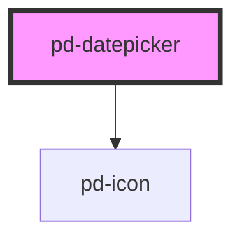

# pd-datepicker

<!-- Auto Generated Below -->

## Properties

| Property         | Attribute         | Description                                                                                                                                                     | Type                                       | Default     |
| ---------------- | ----------------- | --------------------------------------------------------------------------------------------------------------------------------------------------------------- | ------------------------------------------ | ----------- |
| `allowInput`     | `allow-input`     | Allow manual input                                                                                                                                              | `boolean`                                  | `false`     |
| `config`         | --                | Set the configuration for the datepicker (only applied at instantiation) Check out https://flatpickr.js.org/options for further documentation about this config | `BaseOptions`                              | `undefined` |
| `date`           | `date`            | Sets the current selected date(s), which can be a date string (using current dateFormat), a Date, or anArray of the Dates.                                      | `Date \| DateOption[] \| number \| string` | `undefined` |
| `disabled`       | `disabled`        | If `true`, the user cannot interact with the input.                                                                                                             | `boolean`                                  | `false`     |
| `error`          | `error`           | Shows error state                                                                                                                                               | `boolean`                                  | `false`     |
| `hideClearIcon`  | `hide-clear-icon` | Hides the clear icon                                                                                                                                            | `boolean`                                  | `false`     |
| `icon`           | `icon`            | If `true`, a calendar icon is shown at the end of the input.                                                                                                    | `boolean`                                  | `true`      |
| `label`          | `label`           | datepicker box label                                                                                                                                            | `string`                                   | `undefined` |
| `placeholder`    | `placeholder`     | Instructional text that shows before the input has a value.                                                                                                     | `string`                                   | `undefined` |
| `readonly`       | `readonly`        | If `true`, the user cannot modify the value.                                                                                                                    | `boolean`                                  | `false`     |
| `required`       | `required`        | If `true`, the user must fill in a value before submitting a form.                                                                                              | `boolean`                                  | `false`     |
| `size`           | `size`            | Input tag size (check pd-input 'size' for more info)                                                                                                            | `number`                                   | `1`         |
| `verticalAdjust` | `vertical-adjust` | Default vertical adjustment for inline forms                                                                                                                    | `boolean`                                  | `false`     |

## Events

| Event             | Description | Type                                                       |
| ----------------- | ----------- | ---------------------------------------------------------- |
| `pd-change`       |             | `CustomEvent<{ selectedDates: Date[]; dateStr: string; }>` |
| `pd-close`        |             | `CustomEvent<{ selectedDates: Date[]; dateStr: string; }>` |
| `pd-month-change` |             | `CustomEvent<{ selectedDates: Date[]; dateStr: string; }>` |
| `pd-open`         |             | `CustomEvent<{ selectedDates: Date[]; dateStr: string; }>` |
| `pd-ready`        |             | `CustomEvent<{ selectedDates: Date[]; dateStr: string; }>` |
| `pd-value-update` |             | `CustomEvent<{ selectedDates: Date[]; dateStr: string; }>` |
| `pd-year-change`  |             | `CustomEvent<{ selectedDates: Date[]; dateStr: string; }>` |

## Methods

### `activate() => Promise<void>`

Initializes the datepicker again without setting a date. Needed for example in Vue's KeepAlive, when the Instance was destroyed and needs to be re-initialized.

#### Returns

Type: `Promise<void>`

### `clear() => Promise<void>`

Resets the selected dates (if any) and clears the input.

#### Returns

Type: `Promise<void>`

### `close() => Promise<void>`

Closes the calendar.

#### Returns

Type: `Promise<void>`

### `open() => Promise<void>`

Shows/opens the calendar.

#### Returns

Type: `Promise<void>`

### `set(option: any, value?: any) => Promise<void>`

Sets a config option to value, redrawing the calendar and updating the current view, if necessary.
Check out https://flatpickr.js.org/options or https://flatpickr.js.org/instance-methods-properties-elements/#setoption-value for further documentation about this config

#### Parameters

| Name     | Type  | Description |
| -------- | ----- | ----------- |
| `option` | `any` |             |
| `value`  | `any` |             |

#### Returns

Type: `Promise<void>`

### `setDate(date: DateOption | DateOption[], triggerChange?: boolean, format?: string) => Promise<void>`

Sets the current selected date(s) to date, which can be a date string, a Date, or anArray of the Dates.
Optionally, pass true as the second argument to force any onChange events to fire.
And if you’re passing a date string with a format other than your dateFormat, provide a dateStrFormat e.g. "m/d/Y"

#### Parameters

| Name            | Type                         | Description |
| --------------- | ---------------------------- | ----------- |
| `date`          | `DateOption \| DateOption[]` |             |
| `triggerChange` | `boolean`                    |             |
| `format`        | `string`                     |             |

#### Returns

Type: `Promise<void>`

### `toggle() => Promise<void>`

Shows/opens the calendar if its closed, hides/closes it otherwise.

#### Returns

Type: `Promise<void>`

## CSS Custom Properties

| Name                              | Description         |
| --------------------------------- | ------------------- |
| `--pd-datepicker-vertical-adjust` | top margin of label |
| `--pd-input-vertical-adjust`      | top margin of input |

## Dependencies

### Depends on

- [pd-icon](../pd-icon)

### Graph

----------------------------------------------

*Built with [StencilJS](https://stenciljs.com/)*
